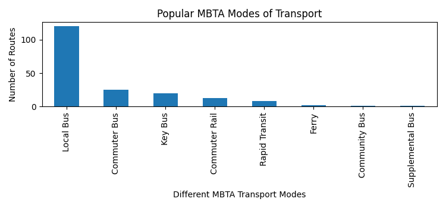

# &nbsp; &nbsp;&nbsp;&nbsp;&nbsp;&nbsp; &nbsp;&nbsp;&nbsp;&nbsp;&nbsp;&nbsp;&nbsp;&nbsp;&nbsp;&nbsp;&nbsp;&nbsp;&nbsp;&nbsp;&nbsp;&nbsp;MBTA Passenger Pickup Efficiency

**MBTA** ([Massachusetts Bay Transport Authority](https://en.wikipedia.org/wiki/Massachusetts_Bay_Transportation_Authority)) is the public agency responsible for operating most public transportation services in Greater Boston, Massachusetts. It's Annual Ridership stands at 160 Million making it one of the most used, popular urban transport anywhere in the USA. From students to elders, nurses, and doctors, there is no doubt that the positive impact it has made is life changing. It is cheap, convenient, reaches most major hotspots, and is time friendly. With that being said, The MBTA has been running into a lot of service disruptions and cost-overruns for quite a while for numerous reasons. 

With Recent developments in technology in the domain of Data Science and Machine Learning, one can’t help but think: **How can we apply these advancements in Data Analysis to help make it more efficient, and reach full functionality.** One of the most effective methods is observing data channels such as hotspots, crowded stations, hours of the day, days of the week, and accordingly adjust timetables and/or routes to make the routes more efficient. Be it time, space, or energy, there are a lot of factors that go into making that decision. Essentially we will be conducting a data study where we hope to identify key "pain points" that could be addressed further to make it truly a world-class and efficient urban transportation service. 

## Data Sources

**The Data is being taken from the MBTA's latest V3 API:** 

- [MBTA Documentation for V3 API](https://api-v3.mbta.com/docs/swagger/index.html)
- [MBTA V3 API Key Request](https://api-v3.mbta.com/portal)
- [MBTA V3 API Website](https://www.mbta.com/developers/v3-api)

## Project partners

- Venkata Krishna Rao, Chelamkuri (**Repo Admin**, **Project Collaborator**)
- Nicholas El Habr, (**Project Collaborator**)
- Ilia Xheblati (**Project Collaborator**)

## Exploratory Data Analysis

The Preliminary Data has been extracted from the MBTA V3 API after unpacking the .json file and the unpacking of the various nested .json tags we were able to analyse the 
most popular and most used MBTA transport services which was Local Bus, Followed by Commuter bus and Rail.
We need to Dwelve a little bit deeper to understand the various load factors and the foot-fall which happens at these various modes of transportation as seen in the figure down below.  

This figure could be reproduced by `make app1`

## Project Plan

**For Project Plan Milestones / Timelines / Roles and Responsibilities:**  
**Click on the Link:** [Click Here](plan.md)

## Stakeholder for the Project
Ilia is working on a consulting project for the [MBTA](https://www.linkedin.com/posts/be-edge_meet-the-team-massachusetts-bay-transportation-activity-6940316466185416704-K4YX?utm_source=linkedin_share&utm_medium=member_desktop_web). The consulting team, whom Ilia is working with, did not have time to analyze MBTA public data to make a data driven decision. Ilia presented this challenge to Krishna and Nicholas. We all decided to work together to analyze the MBTA public data and share our findings with the consulting team and our MBTA stakeholder, Eric Burkman, Director of Transit Priority at MBTA.
